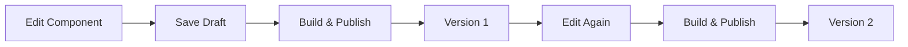

Components are the building blocks within a canvas. Each component represents an element that can be configured, styled, and composed into widgets.

## Overview

With the Components API, you can:

- List components in a canvas
- Create new components
- Update component properties
- Delete components
- Fetch components by widget

## List Components

Retrieve all components for a canvas:

```typescript
import { ComponentsApi } from '@widgetic/api-sdk';

const components = new ComponentsApi('YOUR_API_KEY');

const { data, meta } = await components.getComponents({
  canvasId: '123e4567-e89b-12d3-a456-426614174000',
  page: 1,
  size: 20
});

console.log(`Found ${meta.total} components`);
```

## Get Component by ID

Retrieve a specific component within a canvas:

```typescript
const component = await components.getComponent({
  canvasId: '123e4567-e89b-12d3-a456-426614174000',
  componentId: '223e4567-e89b-12d3-a456-426614174001'
});

console.log('Component:', component.name);
console.log('Widget ID:', component.widget_id);
```

## Create Component

Create a new component in a canvas:

```typescript
const newComponent = await components.createComponent({
  canvasId: '123e4567-e89b-12d3-a456-426614174000',
  createComponentRequest: {
    name: 'Chart Component',
    widget_id: '323e4567-e89b-12d3-a456-426614174002',
    is_widget: true,
    description: 'A data visualization component',
    category: 'visualization',
    tags: ['chart', 'data'],
    isPublic: false
  }
});

console.log('Created component:', newComponent.id);
```

## Update Component

Update an existing component:

```typescript
const updated = await components.updateComponent({
  canvasId: '123e4567-e89b-12d3-a456-426614174000',
  componentId: '223e4567-e89b-12d3-a456-426614174001',
  updateComponentRequest: {
    name: 'Updated Chart Component',
    description: 'An updated data visualization component',
    tags: ['chart', 'data', 'updated']
  }
});
```

## Delete Component

Delete a component from a canvas:

```typescript
await components.deleteComponent({
  canvasId: '123e4567-e89b-12d3-a456-426614174000',
  componentId: '223e4567-e89b-12d3-a456-426614174001'
});
```

## Get Components by Widget

Retrieve all components associated with a widget:

```typescript
const { data: widgetComponents } = await components.getComponentsByWidgetId({
  widgetId: '323e4567-e89b-12d3-a456-426614174002',
  page: 1,
  size: 20,
  sort: 'created_at:desc'
});
```

## Get Component Directly

Retrieve a component without knowing its canvas:

```typescript
const component = await components.getComponentById({
  componentId: '223e4567-e89b-12d3-a456-426614174001'
});
```

## Component Structure

A component object contains:

```typescript
interface Component {
  id: string;                    // Unique identifier
  name: string;                  // Display name
  description?: string;          // Optional description
  widget_id?: string;            // Associated widget ID
  is_widget: boolean;            // Is this a widget component?
  version?: string;              // Component version
  category?: string;             // Category for organization
  tags?: string[];               // Tags for filtering
  isPublic: boolean;             // Public visibility
  created_at: string;            // ISO timestamp
  updated_at: string;            // ISO timestamp
}
```

## Component Categories

Organize components by category:

| Category | Description |
|----------|-------------|
| `visualization` | Charts, graphs, data displays |
| `media` | Images, videos, audio |
| `form` | Input fields, buttons, forms |
| `layout` | Containers, grids, panels |
| `navigation` | Menus, tabs, breadcrumbs |
| `content` | Text, cards, lists |

## Component Versions

Components track versions through the publish workflow:



## Publishing Components

Publish a component to create a new version:

```typescript
// This triggers the build workflow
const result = await components.publishComponent({
  canvasId: '123e4567-e89b-12d3-a456-426614174000',
  componentId: '223e4567-e89b-12d3-a456-426614174001',
  publishRequest: {
    vmSessionId: 'vm-session-uuid',
    repositoryId: 'repository-uuid'
  }
});

console.log('Build triggered:', result.eventId);
```

## Related Endpoints

| Endpoint | Description |
|----------|-------------|
| `GET /canvases/{canvasId}/components` | List components in a canvas |
| `GET /canvases/{canvasId}/components/{componentId}` | Get specific component |
| `POST /canvases/{canvasId}/components` | Create component |
| `PUT /canvases/{canvasId}/components/{componentId}` | Update component |
| `DELETE /canvases/{canvasId}/components/{componentId}` | Delete component |
| `GET /widgets/{widgetId}/components` | Get components by widget |
| `GET /component/{componentId}` | Get component by ID |

## Next Steps

<CardGroup cols={2}>
  <Card title="Canvases" icon="palette" href="/docs/api/canvases">
    Manage canvases
  </Card>
  <Card title="Widgets" icon="cube" href="/docs/api/widgets">
    Build complete widgets
  </Card>
</CardGroup>
