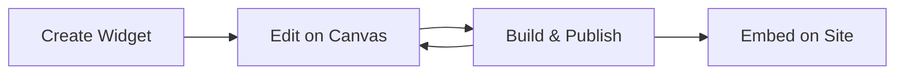

Widgets are the core building blocks in Widgetic. Each widget is a self-contained, configurable UI component that can be embedded anywhere.

## Overview

With the Widgets API, you can:

- List all widgets in your account
- Retrieve widget details
- Batch fetch multiple widgets
- Track widget analytics

## List Widgets

Retrieve all widgets with pagination:

```typescript
import { WidgetsApi } from '@widgetic/api-sdk';

const widgets = new WidgetsApi('YOUR_API_KEY');

const { data, meta } = await widgets.getWidgets({
  page: 1,
  size: 20,
  sort: 'created_at:desc'
});

console.log(`Found ${meta.total} widgets`);
```

## Get Widget by ID

Retrieve a specific widget:

```typescript
const widget = await widgets.getWidgetById({
  widgetId: '123e4567-e89b-12d3-a456-426614174000'
});

console.log('Widget:', widget.name);
console.log('Created:', widget.created_at);
console.log('Version:', widget.version);
```

## Batch Fetch Widgets

Retrieve multiple widgets in a single request:

```typescript
const { data: batchWidgets } = await widgets.batchGetWidgets({
  batchRequest: {
    ids: [
      '123e4567-e89b-12d3-a456-426614174000',
      '223e4567-e89b-12d3-a456-426614174001',
      '323e4567-e89b-12d3-a456-426614174002'
    ]
  }
});

batchWidgets.forEach(widget => {
  console.log(`${widget.name}: ${widget.id}`);
});
```

## Widget Structure

A widget object contains:

```typescript
interface Widget {
  id: string;                    // Unique identifier
  name: string;                  // Display name
  description?: string;          // Optional description
  creator_id: string;            // Owner's user ID
  repo_id?: string;              // Associated repository
  database_id?: string;          // Associated database
  version: number;               // Current version number
  is_draft: boolean;             // Draft status
  is_public: boolean;            // Public visibility
  thumbnail_url?: string;        // Preview image
  components_metadata?: ComponentMetadata[];
  created_at: string;            // ISO timestamp
  updated_at: string;            // ISO timestamp
}
```

## Widget Lifecycle



## Filtering Widgets

Filter widgets by various criteria:

```typescript
// Get only published widgets
const published = await widgets.getWidgets({
  is_draft: false,
  sort: 'updated_at:desc'
});

// Get public widgets
const publicWidgets = await widgets.getWidgets({
  is_public: true
});
```

## Widget Versions

Widgets maintain version history. Each publish increments the version:

```typescript
const widget = await widgets.getWidgetById({ widgetId });

console.log(`Current version: ${widget.version}`);

// Version history is accessible through builds
// Each build creates a new version
```

## Embedding Widgets

Once published, widgets can be embedded using the Embed SDK:

```html
<div id="widget-container"></div>

<script type="module">
  import { embed } from '@widgetic/embed-sdk';
  
  embed({
    widgetId: '123e4567-e89b-12d3-a456-426614174000',
    container: '#widget-container',
    version: 'latest' // or specific version number
  });
</script>
```

## Related Endpoints

| Endpoint | Description |
|----------|-------------|
| `GET /widgets` | List all widgets |
| `GET /widgets/{id}` | Get widget by ID |
| `POST /widgets/batch` | Batch fetch widgets |
| `GET /widgets/{id}/components` | Get widget components |

## Next Steps

<CardGroup cols={2}>
  <Card title="Compositions" icon="layer-group" href="/docs/api/compositions">
    Combine widgets into layouts
  </Card>
  <Card title="Canvases" icon="palette" href="/docs/api/canvases">
    Edit widgets on canvases
  </Card>
</CardGroup>
