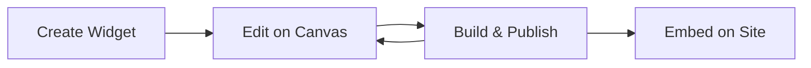

Widgets are the core building blocks in Widgetic. Each widget is a self-contained, configurable UI component that can be embedded anywhere.

## Overview

With the Widgets API, you can:

- List the widgets your account owns, one page at a time
- Create a widget
- Batch fetch up to 50 widgets by ID

## List Widgets

`GET /widgets` lists the widgets your account owns, newest first. Pass `page` (counting from 1) and `size` (1 to 100, 20 when left out) to read the list one page at a time.

<CodeGroup>
```bash cURL
curl "https://api.widgetic.com/v1/widgets?page=1&size=20" \
  -H "Authorization: Bearer YOUR_API_KEY"
```

```typescript TypeScript SDK
import { WidgetsApi } from '@widgetic/api-sdk';

const widgets = new WidgetsApi('YOUR_API_KEY');

const { data, meta } = await widgets.getWidgets({
  page: 1,
  size: 20
});

console.log(`Showing ${data.length} of ${meta?.total} widgets`);
```
</CodeGroup>

`meta` carries the figures you need to walk the list:

```json
{
  "success": true,
  "data": [
    { "id": "3fa85f64-5717-4562-b3fc-2c963f66afa6", "name": "Quarterly sales chart" }
  ],
  "meta": {
    "page": 1,
    "size": 20,
    "total": 134,
    "limit": 20,
    "offset": 0,
    "hasNextPage": true,
    "hasPreviousPage": false
  }
}
```

A page past the end is an empty list, not an error.

<Warning>
  Without `page` and `size`, the call returns the whole list in one response. That only suits an account with a few widgets: for a large one the response can be cut short, and nothing in it says so. If you do not know how many widgets an account holds, always page.
</Warning>

To read every widget, keep asking for the next page until `meta.hasNextPage` is `false`:

```typescript
async function* allWidgets() {
  for (let page = 1; ; page++) {
    const { data, meta } = await widgets.getWidgets({ page, size: 100 });
    yield* data;
    if (!meta?.hasNextPage) return;
  }
}

for await (const widget of allWidgets()) {
  console.log(`${widget.name} (${widget.id})`);
}
```

### Widgets on One Canvas

Pass `canvasId` to list only the widgets on one of your canvases. That list is always returned whole, whatever `page` and `size` say.

```typescript
const { data: onThisCanvas } = await widgets.getWidgets({
  canvasId: '9f0c6b54-3e8f-4a2a-8b7d-1c5c6d9e0a1b'
});
```

<Note>
  The list takes no `sort` or filter parameters: it is always newest first.
</Note>

## Create a Widget

`POST /widgets` creates a widget for your account: a named record with a type and some starting content, on a canvas of its own (or one of yours that you name), with a database provisioned for it. It costs no credits and has no code yet; the code is generated for it afterwards. A widget is a draft until you send `isDraft: false`.

<CodeGroup>
```bash cURL
curl -X POST "https://api.widgetic.com/v1/widgets" \
  -H "Authorization: Bearer YOUR_API_KEY" \
  -H "Content-Type: application/json" \
  -H "Idempotency-Key: 7b1d5a52-2f3c-4f0e-9a58-5d3b7a6a9c11" \
  -d '{
    "name": "Quarterly sales chart",
    "type": "chart",
    "content": { "chartType": "bar" }
  }'
```

```typescript TypeScript SDK
import { randomUUID } from 'node:crypto';

// The API needs an Idempotency-Key header, and the SDK does not add one, so pass it in the second argument.
// Keep the key if you retry, so that one widget is created, not two.
const idempotencyKey = randomUUID();

const { data: widget } = await widgets.createWidget(
  {
    newWidget: {
      name: 'Quarterly sales chart',
      type: 'chart',
      content: { chartType: 'bar' }
    }
  },
  async ({ init }) => ({ headers: { ...init.headers, 'Idempotency-Key': idempotencyKey } })
);

console.log(`Created ${widget.id}`);
```
</CodeGroup>

The response has status `201` and carries the new widget in `data` (shortened here):

```json
{
  "success": true,
  "data": {
    "id": "3fa85f64-5717-4562-b3fc-2c963f66afa6",
    "name": "Quarterly sales chart",
    "type": "chart",
    "isDraft": true,
    "isPublic": false,
    "canvasId": "9f0c6b54-3e8f-4a2a-8b7d-1c5c6d9e0a1b",
    "createdAt": "2026-10-02T12:00:00.000Z"
  }
}
```

### Fields

| Field | Required | Description |
|-------|----------|-------------|
| `name` | Yes | Name of the widget |
| `type` | Yes | What kind of widget this is, a label of your choosing (for example `chart`, `form`, `gallery`) |
| `content` | Yes | Starting content, as an object. `{}` is fine |
| `isPublic` | No | Whether the widget is public. Default `false` |
| `isDraft` | No | Whether the widget starts as a draft. Default `true` |
| `canvasId` | No | Put the widget on this existing canvas instead of a new one. You must own the canvas |
| `projectId` | No | Project to file the widget in. You must be able to edit the project |
| `organizationId` | No | Organization the widget belongs to. You must be a member who may create widgets there |
| `workspaceType` | No | `personal` or `organization` |

Only the fields above are used. Anything else in the body is ignored.

### Where a Widget Can Go

`canvasId`, `projectId` and `organizationId` must name something you may use. Naming anything else is refused with `403`, and the answer is the same whether the id exists or not, so it never tells you whether an id you guessed is real. Leave `canvasId` out to give the widget a canvas of its own.

### Warnings

If the widget's database cannot be provisioned, the widget is still created and `data.warnings` is a list of what did not go through. It is absent when everything did. Read it before relying on the widget.

### Retrying and Limits

- The `Idempotency-Key` header is required (`400` without it). Send the **same** value when you retry, so one widget is created, not two. See [Idempotency](/docs/reference/idempotency).
- Creating a widget provisions its database, so this call has a limit of its own: 120 per minute for each account, counted across all of that account's keys. Past that the API answers `429` with a `Retry-After` header. If you need more, ask Widgetic. See [Rate Limits](/docs/reference/rate-limits).

## Batch Fetch Widgets

`POST /widgets/batch` returns up to 50 widgets by ID in one request. A widget that cannot be returned comes back in `errors`, with the reason, while the others still come back in `widgets`.

```typescript
const { widgets: batchWidgets, errors } = await widgets.getWidgetsBatch({
  getWidgetsBatchRequest: {
    widgetIds: [
      '123e4567-e89b-12d3-a456-426614174000',
      '223e4567-e89b-12d3-a456-426614174001',
      '323e4567-e89b-12d3-a456-426614174002'
    ]
  }
});

batchWidgets?.forEach(widget => {
  console.log(`${widget.name}: ${widget.id}`);
});
```

## Widget Structure

A widget object contains:

```typescript
interface Widget {
  id: string;                    // Unique identifier
  name: string;                  // Display name
  description?: string | null;   // Optional description
  type: string;                  // What kind of widget this is
  content: Record<string, unknown>; // Content configuration
  creatorId: string;             // Owner's user ID
  canvasId?: string | null;      // The canvas the widget is on
  repoId?: string | null;        // Associated repository
  databaseId?: string | null;    // Associated database
  version?: number | null;       // Current version number
  isDraft: boolean;              // Draft status
  isPublic: boolean;             // Public visibility
  shareId?: string | null;       // ID for sharing the widget publicly
  jsPath?: string | null;        // Path to the widget's JavaScript file
  componentsMetadata?: ComponentMetadata[] | null;
  createdAt: string;             // ISO timestamp
  updatedAt: string;             // ISO timestamp
}
```

## Widget Lifecycle


```mermaid
flowchart LR
    Create[Create Widget] --> Edit[Edit on Canvas]
    Edit --> Build[Build & Publish]
    Build --> Embed[Embed on Site]
    Build --> Edit
```

## Widget Versions

Widgets keep a version history. A version is created when code is generated for the widget, and it becomes live when it is published.

## Embedding Widgets

A widget is shown on a page through a composition. Create a [composition](/docs/api/compositions) on the widget, fill in its values, and put the embed code in your page:

```html
<script src="https://cdn.widgetic.com/sdks/browser/embed-sdk.js?v=6"></script>
<widgetic composition-id="COMPOSITION_ID" resize="fill-width" width="800" height="450" autoscale="on" adaptive="480" embed-target="site"></widgetic>
```

The widget needs a published version before it can be shown. Until then the public address answers `404`. See [Compositions](/docs/api/compositions#embedding-compositions) for the attributes, and [SDKs](/resources/sdks#embed-script) for the embed script.

## Related Endpoints

| Endpoint | Description |
|----------|-------------|
| `GET /widgets` | List the widgets your account owns |
| `POST /widgets` | Create a widget |
| `POST /widgets/batch` | Batch fetch widgets |
| `GET /widgets/{widgetId}/components` | Get widget components |

## Next Steps

<CardGroup cols={2}>
  <Card title="Compositions" icon="layer-group" href="/docs/api/compositions">
    Set a widget up for one place and embed it
  </Card>
  <Card title="Canvases" icon="palette" href="/docs/api/canvases">
    Edit widgets on canvases
  </Card>
</CardGroup>
