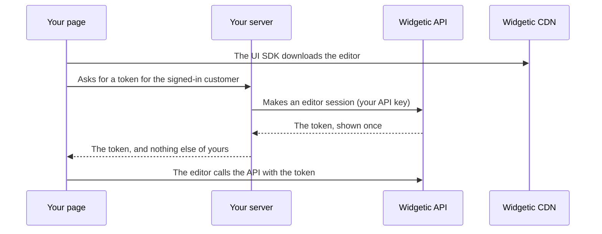

An editor session is a short-lived credential that lets the browser of **one** of your customers use Widgetic's editors on **that customer's** content, and nothing else. Your server makes it with your API key and hands only the token to the page. The key never leaves your server.

You rarely call the browser side yourself: the [UI SDK](/docs/partners/ui-components) asks your page for the token and the editors use it. This page is about the server side: making sessions, what a session can and cannot do, how long it lives, and how to end it.

<Note>
  **Preview.** The editors you mount with the UI SDK are new. The calls on this page are built and tested, and you can try them now, but small details can still change while this label is on. Tell us what you find at [support@widgetic.com](mailto:support@widgetic.com).
</Note>

## How it works



A session belongs to one [managed user](/docs/partners/managed-users). Everything that session reads or makes is that managed user's: a composition, widget, canvas or file that was made for another of your customers answers `404`, exactly as if it did not exist.

## Make a session

Call this from your server, when the page that holds the editor opens. `{id}` is Widgetic's `id` for the managed user (the UUID the create call gave you), not your own `external_id`.

<CodeGroup>

```bash cURL
curl -sS -X POST "https://api.widgetic.com/v1/managed-users/$MANAGED_USER_ID/editor-sessions" \
  -H "Authorization: Bearer $WIDGETIC_PARTNER_KEY" \
  -H "Content-Type: application/json" \
  -d '{
    "surfaces": ["creator", "editor", "files"],
    "expires_in_seconds": 3600,
    "allowed_origin": "https://app.example.com"
  }'
```

```typescript TypeScript SDK
import { ManagedUsersApi } from '@widgetic/api-sdk';

const managedUsersApi = new ManagedUsersApi(process.env.WIDGETIC_PARTNER_KEY!);

// On your server, when the page that hosts the editor opens for one of your customers:
const session = await managedUsersApi.createManagedUserEditorSession({
  id: managedUserId,
  newEditorSession: {
    surfaces: ['creator', 'editor', 'files'],
    expires_in_seconds: 3600,
    allowed_origin: 'https://app.example.com',
  },
});

// Send session.token to that customer's browser, and nothing else of yours.
```

</CodeGroup>

| Field | Required | |
|-------|----------|---|
| `surfaces` | Yes | What the session may do. One or more of `files`, `editor` and `creator`. See [Surfaces](#surfaces). |
| `expires_in_seconds` | No | How long the session lasts: 60 to 14400 (four hours). Default 3600. It cannot be extended: make a new session when it ends. |
| `allowed_origin` | No | Bind the session to one web page origin, such as `https://app.example.com` (no path; `http` only for `localhost`). See [Bind it to your page](#bind-it-to-your-page). |

The answer is `201`:

```json
{
  "success": true,
  "data": {
    "token": "wgt_ses_3q2-7wA9vJm5cH1xT0uY8pZkR4nLd6BfGeSoVi2tMqE",
    "sessionId": "9c1d6b7e-5d54-4a0e-8d52-0f3e3c0a6a11",
    "managedUserId": "3f0c9a52-8e0a-4a52-9d52-5d8a1f1b7c10",
    "managedUserExternalId": "your-platform-user-123",
    "surfaces": ["creator", "editor", "files"],
    "allowedOrigin": "https://app.example.com",
    "expiresAt": "2026-10-04T14:00:00.000Z",
    "createdAt": "2026-10-04T13:00:00.000Z"
  }
}
```

- **The token is shown once.** It starts with `wgt_ses_`, and the answer is sent with `Cache-Control: no-store`. Widgetic keeps only a fingerprint of it, so a lost token cannot be read back: make another session.
- **`sessionId` is not a credential.** It is only the handle you use to [end the session](#end-a-session).
- Each call makes a new session. It does not take an `Idempotency-Key`, because a retry cannot be given the token back.

### A server endpoint for your page

Your page needs one endpoint of yours that checks who is signed in, makes a session for that customer and returns the token. The UI SDK calls it again shortly before the token runs out, so the customer is never interrupted.

```javascript
// Express. WIDGETIC_PARTNER_KEY lives in your server's environment and goes nowhere else.
app.post('/widgetic-session', requireSignedInUser, async (request, response) => {
  const managedUserId = await lookUpWidgeticIdOf(request.user); // the managed user you made for this customer

  const widgetic = await fetch(`https://api.widgetic.com/v1/managed-users/${managedUserId}/editor-sessions`, {
    method: 'POST',
    headers: { Authorization: `Bearer ${process.env.WIDGETIC_PARTNER_KEY}`, 'Content-Type': 'application/json' },
    body: JSON.stringify({
      surfaces: ['creator', 'editor', 'files'],
      expires_in_seconds: 3600,
      allowed_origin: 'https://app.example.com',
    }),
  });
  if (!widgetic.ok) return response.status(502).json({ error: 'Could not start a Widgetic session' });

  const { data: session } = await widgetic.json(); // every answer of the API is { success, data }
  response.set('Cache-Control', 'no-store').json({ token: session.token, expiresAt: session.expiresAt });
});
```

## Surfaces

A session can do only what its surfaces allow. The surfaces do not imply one another, so ask for every one the editor you mount needs.

| Surface | What the session may do | Editor that needs it |
|---------|------------------------|----------------------|
| `files` | Upload a file and list the files uploaded for this customer. Every file is filed under this customer and stored the way your own uploads are: in your own storage destination when you have one, otherwise in Widgetic's storage, where it counts against your account's storage. | File Browser |
| `editor` | Open one of this customer's compositions, read its content, design, embed settings and schemas, and change its name, content, design and embed settings. | Composition editor |
| `creator` | Everything the widget creator does for this customer: draw on canvases and save them, make and change widgets, talk to the AI, build, preview and publish a version, and list and make compositions of the widgets it built. | Widget creator |

- **File Browser:** `["files"]`.
- **Composition editor:** `["editor", "files"]`.
- **Widget creator:** `["creator", "editor", "files"]`. The creator saves the composition it is editing (`editor`) and attaches pictures to its chat (`files`).

The calls behind each surface are listed in the [API Reference](/api-reference/introduction), under `createManagedUserEditorSession`.

### What a session never does

Everything outside its surfaces is refused with `403` and the code `EDITOR_SESSION_ROUTE_NOT_ALLOWED`. In particular a session cannot:

- read or change your account, your keys, your contract, your invoices or your credits;
- make more sessions, or list or end sessions;
- see another of your customers' compositions, widgets, canvases, conversations or files (those answer `404`);
- delete a composition (create it yourself with your key, then open the editor on it);
- make a widget public: what a customer builds stays private to your account (publishing a version of the widget is allowed and does not make it public);
- file anything under a project or an organization, or set a field the editors do not set. A body with such a field is refused with `403` and `EDITOR_SESSION_FIELD_NOT_ALLOWED`.

<Note>
  This is the difference between a session and your API key. Your key reaches everything on your account, whoever it was filed under. A session reaches only its own customer's content.
</Note>

## Content the editors can open

A session reaches only content that was **filed under its managed user**:

- **Compositions:** create them on your server with your key and name the customer (`managedUserId` or `managedUserExternalId`, see [Filing Content Under a Managed User](/docs/partners/managed-users#filing-content-under-a-managed-user)), then mount the composition editor on the composition's `id`. A composition you made without naming a customer is not reachable by any session.
- **Widgets, canvases and compositions made in the widget creator** are filed under the session's managed user automatically. List them from your server with the same `managedUserId` filter.
- **Files** a session uploads are filed under its managed user and listed back only for it.

## Bind it to your page

Give `allowed_origin` the origin of the page that mounts the editor. The session is then refused from any other origin, and from a request that carries no `Origin` header, so a token copied out of your page is useless anywhere else. It is stored as `scheme://host[:port]`: `https` (or `http` for `localhost`, `127.0.0.1` and `[::1]`), no path, query or credentials, and no wildcard.

Leave it out only for a session that is used from a server.

## Lifetime

- A session lasts from 60 seconds to four hours (`expires_in_seconds`, default one hour). It cannot be extended.
- A managed user can hold up to 100 live sessions. Another request answers `429` with `EDITOR_SESSION_LIMIT_REACHED`; end the ones you no longer need.
- Mint a session per page open and per customer, from an endpoint that checks who is signed in. Never give one customer's token to another.
- Switching the managed user off or deleting it ends all of its sessions.

## End a session

End one session, or all of a customer's sessions, for example when they sign out of your platform. Both need your key and take effect on the next request (allow up to 15 seconds for every server of ours to notice).

```bash
# One session
curl -sS -X DELETE "https://api.widgetic.com/v1/managed-users/$MANAGED_USER_ID/editor-sessions/$SESSION_ID" \
  -H "Authorization: Bearer $WIDGETIC_PARTNER_KEY"

# Every live session of the customer
curl -sS -X DELETE "https://api.widgetic.com/v1/managed-users/$MANAGED_USER_ID/editor-sessions" \
  -H "Authorization: Bearer $WIDGETIC_PARTNER_KEY"
```

The first answers `200` with the session's id (and `404` `EDITOR_SESSION_NOT_FOUND` for one that was never yours; ending a session that already ended is fine). The second answers `200` with `{ "ended": 2 }`, the number of sessions it ended, and is fine for a customer who has none.

## Credits and limits

The AI is paid for by **your account**, as your own calls are: a generation a customer starts uses the same credit as one you start with your key (see [Credits & Billing](/docs/partners/credits-billing)). Widgetic's storage counts against your account's storage too.

- **Each customer has an allowance of their own.** What a customer does with the AI is counted per customer, not per account or per session: one busy customer cannot use up the others' turns, a customer who opens many sessions still has one allowance, and your own calls with your key are counted separately. At the moment a customer can start about 26 generations or builds an hour and about 130 a day. A customer who uses it up is refused with `429`, the code `COST_LIMIT_EXCEEDED` and a `Retry-After` header, and only that customer is. It also keeps a script in one browser from spending your whole wallet. Tell us if your customers need more: the allowance can be raised.
- **Your credits, plan and storage are yours.** When your account cannot pay, every customer is refused: `402` `BILLING_INSUFFICIENT_CREDITS` (credits), `403` `AUTHZ_PLAN_RESTRICTION` (your plan does not include it) or `413` `QUOTA_STORAGE_EXCEEDED` (storage). A customer is never told what your account holds: the message is one plain sentence, "This is not available right now. Please try again later.", with no balance, cost or plan. The same calls made with your key keep the full messages.
- **The editors tell your page.** The widget creator reports these as a `limitReached` event, once per code in half a minute, so your page can offer more or tell its own team. See [Canvas Embedding](/docs/partners/canvas-embedding#when-a-limit-is-reached).
- **Ordinary rate limiting** (`RATE_LIMIT_EXCEEDED`) counts the address each request comes from, not your account, so your customers do not share it. It is not a limit your page needs to report.

## Browsers

A browser may call the API with a session token from any origin. The API answers the preflight request for the calls a session may make, echoes the origin on the real call, and never sends `Access-Control-Allow-Credentials`: a session does not use cookies, only the `Authorization` header. It exposes the `Retry-After`, `X-Idempotency-Cached` and `X-Correlation-Id` headers to the page. Quote the `X-Correlation-Id` to Widgetic's support when you report a problem.

If your page sends a Content-Security-Policy, see [UI Components](/docs/partners/ui-components#content-security-policy) for what the editors need.

## Errors

The browser side of a session answers with these. The editors handle them for you and tell your page (`error` event with `sessionEnded: true` when the token cannot be used again).

| Status | Code | Meaning | What to do |
|--------|------|---------|------------|
| 401 | `EDITOR_SESSION_INVALID` | The token is not one of ours | Mint a new session |
| 401 | `EDITOR_SESSION_EXPIRED` | The session ran out | Mint a new session |
| 401 | `EDITOR_SESSION_REVOKED` | You ended it, or the customer was switched off | Mint a new session if the customer should continue |
| 401 | `EDITOR_SESSION_USER_UNAVAILABLE` | The managed user no longer exists or is switched off | Do not mint another until the customer is back |
| 403 | `EDITOR_SESSION_ORIGIN_NOT_ALLOWED` | The session is bound to another page | Mint it with this page's `allowed_origin` |
| 403 | `EDITOR_SESSION_ROUTE_NOT_ALLOWED` | A session cannot make this call | Not a session's job: do it from your server |
| 403 | `EDITOR_SESSION_FIELD_NOT_ALLOWED` | The request sets a field a session may not set | Remove the field |
| 404 | `RESOURCE_…_NOT_FOUND`, such as `RESOURCE_WIDGET_NOT_FOUND` | The item is not this customer's, does not exist, or is not even an id | File it under the customer, or check the id |
| 503 | `EDITOR_SESSIONS_DISABLED` | Editor sessions are switched off for the moment | Try again later |

Making a session can also answer: `400` (a surface that does not exist, `expires_in_seconds` out of range, or `allowed_origin` that is not an origin), `403` (the caller is not a partner), `404` `MANAGED_USER_NOT_FOUND`, `409` `MANAGED_USER_INACTIVE` (switched off managed users get no sessions), `429` `EDITOR_SESSION_LIMIT_REACHED` and `503` `EDITOR_SESSIONS_DISABLED`.

## Security checklist

<Steps>
  <Step title="Keep the key on your server">
    Make sessions only from your server. Never send your `wgt_prt_` key, or a token from `/tokens/exchange`, to a browser: those carry the access of your whole account. Use an editor session instead.
  </Step>
  <Step title="Check who is signed in">
    Your endpoint must make the session for the customer who is signed in, and for nobody else.
  </Step>
  <Step title="Bind it to your page">
    Send `allowed_origin` so that a copied token is useless on any other web page.
  </Step>
  <Step title="Keep tokens out of logs, storage and URLs">
    Hold the token in memory. The UI SDK does.
  </Step>
  <Step title="End sessions when customers leave">
    Call `DELETE /managed-users/{id}/editor-sessions` when a customer signs out, and switch the managed user off when their plan on your platform ends.
  </Step>
</Steps>

## Next Steps

<CardGroup cols={2}>
  <Card title="UI Components" icon="puzzle-piece" href="/docs/partners/ui-components">
    Mount the editors in your page with the UI SDK
  </Card>
  <Card title="Canvas Embedding" icon="window" href="/docs/partners/canvas-embedding">
    The widget creator and the composition editor
  </Card>
  <Card title="Managed Users" icon="users" href="/docs/partners/managed-users">
    File your customers' content under them
  </Card>
  <Card title="Credits & Billing" icon="credit-card" href="/docs/partners/credits-billing">
    How the AI is paid for
  </Card>
</CardGroup>
