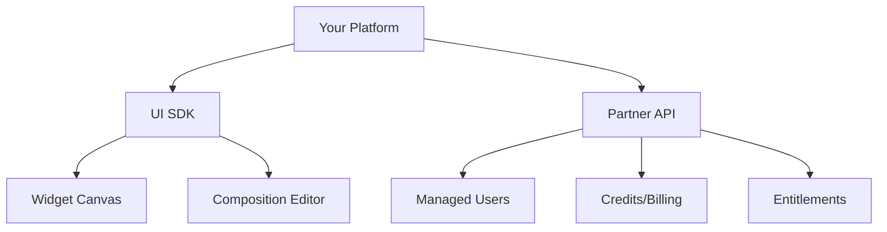

# Partner Integration Overview

Partners can embed the Widgetic canvas as a white-label solution, allowing their end-users to create and manage widgets directly within their platform.

## What Partners Can Do

<CardGroup cols={2}>
  <Card title="Embed the Canvas" icon="palette">
    Integrate the full widget creation experience in your platform
  </Card>
  <Card title="Manage End-Users" icon="users">
    Create and manage user accounts for your customers
  </Card>
  <Card title="White-Label UI" icon="paintbrush">
    Customize the look and feel to match your brand
  </Card>
  <Card title="Credits & Billing" icon="credit-card">
    Manage operational credits and billing for your users
  </Card>
</CardGroup>

## Partner API Key

Partners use API keys with the `wgt_prt_` prefix. These keys have access to:

- All user-level endpoints
- Partner-specific endpoints (managed users, UI components, partner billing)
- The ability to act on behalf of managed users

## Architecture Overview



## Key Concepts

### Managed Users

Managed users are end-users of your platform. You create and manage them via the API, and they can use Widgetic features through your integration.

```typescript
import { ManagedUsersApi } from '@widgetic/api-sdk';

const managedUsers = new ManagedUsersApi('wgt_prt_your_partner_key');

// Create a managed user
const user = await managedUsers.createManagedUser({
  external_id: 'your-platform-user-123',
  metadata: {
    name: 'John Doe',
    email: 'john@example.com'
  }
});
```

### UI Components

Partners can embed pre-built UI components:

- **Widget Creator**: Full widget creation experience
- **Composition Editor**: Edit widget layouts and configurations  
- **Embed Editor**: Configure widget embed settings

### Credits System

Partners purchase operational credits that are consumed when their users use Widgetic features:

- AI-powered widget generation
- Storage usage
- API calls (above free tier)

## Getting Started

<Steps>
  <Step title="Obtain Partner API Key">
    Contact our sales team to upgrade to a partner account and receive your `wgt_prt_` API key.
  </Step>
  <Step title="Set Up Managed Users">
    [Create managed users](/docs/partners/managed-users) for your platform's customers.
  </Step>
  <Step title="Embed UI Components">
    Follow the [Canvas Embedding guide](/docs/partners/canvas-embedding) to integrate the canvas.
  </Step>
  <Step title="Configure Credits">
    Set up your [credits and billing](/docs/partners/credits-billing) configuration.
  </Step>
</Steps>

## Partner Endpoints

All partner endpoints require a `wgt_prt_` API key. Key endpoints include:

| Endpoint | Description |
|----------|-------------|
| `GET /managed-users` | List all managed users |
| `POST /managed-users` | Create a new managed user |
| `GET /ui/components` | List available UI components |
| `POST /ui/components/{id}/mount` | Mount a UI component |
| `GET /partners/{id}/credits/balance` | Check credit balance |

<Info>
  See the [API Reference](/api-reference/introduction) for complete endpoint documentation. Filter by the `Managed Users`, `UI Components`, and `Partners` tags.
</Info>

## Next Steps

<CardGroup cols={2}>
  <Card title="Canvas Embedding" icon="window" href="/docs/partners/canvas-embedding">
    Learn how to embed the canvas in your platform
  </Card>
  <Card title="Managed Users" icon="users" href="/docs/partners/managed-users">
    Create and manage end-users
  </Card>
</CardGroup>
