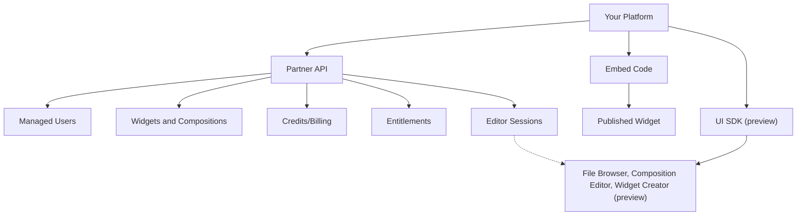

Partners build widgets for their own customers with the Widgetic API, and show them in their own platform with the embed code. In preview, you can also mount Widgetic's own editors (a file browser, a composition editor and the AI widget creator) in your own page for one customer at a time, without your API key ever reaching the browser.

## What Partners Can Do

<CardGroup cols={2}>
  <Card title="Build and Embed Widgets" icon="palette">
    Create compositions with the API and show the published widgets in your platform with the embed code
  </Card>
  <Card title="Keep Track of End-Users" icon="users">
    Keep a record of your customers as managed users
  </Card>
  <Card title="Editors in Your Page (preview)" icon="paintbrush" href="/docs/partners/ui-components">
    Mount Widgetic's File Browser, composition editor and AI widget creator in your own page for one customer at a time
  </Card>
  <Card title="Credits & Billing" icon="credit-card">
    Pay by invoice and track the AI credits on your account
  </Card>
</CardGroup>

## Partner API Key

Partners use API keys with the `wgt_prt_` prefix. These keys have access to:

- All user-level endpoints
- Partner-specific endpoints (managed users, your contract, your invoices and your credits)

A key belongs to the account that administers your partner record. Only a person who is signed in on widgetic.com can make a key: a request made with an API key is refused, so a leaked key cannot be used to make a second one. A key can still list, rename, switch off and delete keys.

## Architecture Overview


```mermaid
flowchart TD
    Partner[Your Platform] --> API[Partner API]
    Partner --> Embed[Embed Code]
    API --> Users[Managed Users]
    API --> Compositions[Widgets and Compositions]
    API --> Credits[Credits/Billing]
    API --> Entitlements[Entitlements]
    API --> Sessions[Editor Sessions]
    Embed --> Published[Published Widget]
    Partner --> UI["UI SDK (preview)"]
    UI --> Editors["File Browser, Composition Editor, Widget Creator (preview)"]
    Sessions -.-> Editors
```

The dotted line is the short-lived token your server gives the page, so the editors work with one customer's content and your API key stays on your server.

## Key Concepts

### Managed Users

A managed user is a record of one of your customers in your partner registry. It is not a login, and it does not own anything: everything you create through the API belongs to your administering account. What you can do is file a composition, a widget or an upload under a managed user when you create it, and list your account's items by that managed user later, so each of your customers sees only their own. You create and manage managed users via the API.

```bash
curl -sS -X POST "https://api.widgetic.com/v1/managed-users" \
  -H "Authorization: Bearer $WIDGETIC_PARTNER_KEY" \
  -H "Content-Type: application/json" \
  -H "Idempotency-Key: $(uuidgen)" \
  -d '{ "external_id": "your-platform-user-123", "metadata": { "name": "John Doe", "email": "john@example.com" } }'
```

See [Managed Users](/docs/partners/managed-users) for the full picture.

### Editor Sessions

An editor session is a short-lived token that your server makes for one managed user. Your page gives it to a Widgetic editor, which then reads and changes that customer's content and nothing else. Your API key never reaches the browser. See [Editor Sessions](/docs/partners/editor-sessions).

### UI Components

<Note>
  **Preview.** The editors are new. They are built and tested, and you can try them now, but small details can still change while this label is on.
</Note>

The UI SDK (`@widgetic/ui-sdk`) mounts three pieces in your own page. Each draws inside a shadow root, so your page's styles and its own do not touch each other:

- **File Browser**: browse, upload and pick files, from Widgetic's media library or from your own.
- **Composition Editor**: change the texts, pictures, colours and fonts of a widget, beside a live preview.
- **Widget Creator**: the whole Widgetic canvas, with the AI that builds a widget from a description.

See [UI Components](/docs/partners/ui-components) for the SDK and the File Browser, and [Canvas Embedding](/docs/partners/canvas-embedding) for the composition editor and the widget creator.

### Preset Widgets

A preset is a widget of your own that you offer your customers as a starting point, under a short key your code uses. Your server lists them and gives a customer a copy (or a composition) of the one they pick. See [Preset Widgets](/docs/partners/managed-users#preset-widgets).

### Credits System

You pay Widgetic by invoice. Credits pay for Widgetic's AI: each generation uses 1 credit ($0.10). Creating compositions, embedding widgets, storage and API calls do not use credits. Widgetic adds credits to your account when you ask. See [Credits & Billing](/docs/partners/credits-billing).

## Getting Started

<Steps>
  <Step title="Make Your Partner API Key">
    Contact our sales team to become a partner. Widgetic sets up your partner account; you then sign in and make your own `wgt_prt_` API key under Workspace settings → API keys. The secret is shown once, so store it when you make it. See [Security](/resources/security) for rotating and deleting keys.
  </Step>
  <Step title="Keep Track of Your Customers">
    [Create managed users](/docs/partners/managed-users) for your platform's customers.
  </Step>
  <Step title="Build and Embed Widgets">
    Create [compositions](/docs/api/compositions) with the API, publish them, and show them in your platform with the embed code.
  </Step>
  <Step title="Put the Editors in Your Page (optional)">
    Make an [editor session](/docs/partners/editor-sessions) for the customer who is on the page, and mount a Widgetic editor with the [UI SDK](/docs/partners/ui-components), so your customers make and change widgets without leaving your product.
  </Step>
  <Step title="Agree Your Billing">
    Read how [credits and billing](/docs/partners/credits-billing) work, and agree the price, the invoice dates and the credits with Widgetic.
  </Step>
</Steps>

## Partner Endpoints

All partner endpoints require a `wgt_prt_` API key. Key endpoints include:

| Endpoint | Description |
|----------|-------------|
| `GET /managed-users` | List your managed users |
| `POST /managed-users` | Create a managed user |
| `POST /managed-users/{id}/editor-sessions` | Make an editor session for one managed user |
| `DELETE /managed-users/{id}/editor-sessions` | End every editor session of a managed user |
| `GET /partners/{id}/presets` | List the widgets you offer as presets |
| `PUT /partners/{id}/presets/{key}` | Offer one of your widgets as a preset, or replace the preset with that key |
| `POST /managed-users/{id}/presets/{key}/copy` | Give a customer a copy of one of your presets |
| `GET /partners/{id}/contract` | Read your contract |
| `GET /invoices/partner/{id}` | List your invoices |
| `GET /credits/user/{userId}/balance` | Check your AI credit balance |

<Info>
  See the [API Reference](/api-reference/introduction) for complete endpoint documentation. Filter by the `Managed Users`, `Partners`, `Credits` and `Invoices` tags.
</Info>

## Next Steps

<CardGroup cols={2}>
  <Card title="Managed Users" icon="users" href="/docs/partners/managed-users">
    Keep a record of your customers
  </Card>
  <Card title="Editor Sessions" icon="key" href="/docs/partners/editor-sessions">
    Let a customer use Widgetic's editors in your page
  </Card>
  <Card title="Credits & Billing" icon="credit-card" href="/docs/partners/credits-billing">
    How you pay and how credits work
  </Card>
</CardGroup>
