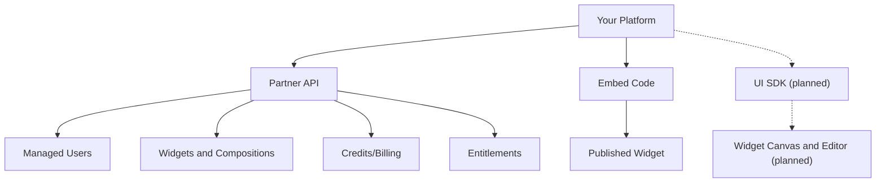

Partners build widgets for their own customers with the Widgetic API, and show them in their own platform with the embed code. A white-label editor that you mount in your own page is planned. It is not available yet.

## What Partners Can Do

<CardGroup cols={2}>
  <Card title="Build and Embed Widgets" icon="palette">
    Create compositions with the API and show the published widgets in your platform with the embed code
  </Card>
  <Card title="Keep Track of End-Users" icon="users">
    Keep a record of your customers as managed users
  </Card>
  <Card title="White-Label Editor (planned)" icon="paintbrush">
    A Widgetic editor that you mount in your own page. Not available yet
  </Card>
  <Card title="Credits & Billing" icon="credit-card">
    Pay by invoice and track the AI credits on your account
  </Card>
</CardGroup>

## Partner API Key

Partners use API keys with the `wgt_prt_` prefix. These keys have access to:

- All user-level endpoints
- Partner-specific endpoints (managed users, your contract, your invoices and your credits)

A key belongs to the account that administers your partner record. Only a person who is signed in on widgetic.com can make a key: a request made with an API key is refused, so a leaked key cannot be used to make a second one. A key can still list, rename, switch off and delete keys.

## Architecture Overview


```mermaid
flowchart TD
    Partner[Your Platform] --> API[Partner API]
    Partner --> Embed[Embed Code]
    API --> Users[Managed Users]
    API --> Compositions[Widgets and Compositions]
    API --> Credits[Credits/Billing]
    API --> Entitlements[Entitlements]
    Embed --> Published[Published Widget]
    Partner -.-> UI["UI SDK (planned)"]
    UI -.-> Canvas["Widget Canvas and Editor (planned)"]
```

The dotted lines are planned and are not available yet.

## Key Concepts

### Managed Users

A managed user is a record of one of your customers in your partner registry. It is not a login, and it does not own anything: everything you create through the API belongs to your administering account. What you can do is file a composition, a widget or an upload under a managed user when you create it, and list your account's items by that managed user later, so each of your customers sees only their own. You create and manage managed users via the API.

```bash
curl -sS -X POST "https://api.widgetic.com/v1/managed-users" \
  -H "Authorization: Bearer $WIDGETIC_PARTNER_KEY" \
  -H "Content-Type: application/json" \
  -H "Idempotency-Key: $(uuidgen)" \
  -d '{ "external_id": "your-platform-user-123", "metadata": { "name": "John Doe", "email": "john@example.com" } }'
```

See [Managed Users](/docs/partners/managed-users) for the full picture.

### UI Components

<Warning>
  **Planned. Not available yet.** A Widgetic editor that you can mount in your own page does not exist today. The editor runs on [widgetic.com](https://widgetic.com) for a signed-in account only, the UI SDK (`@widgetic/ui-sdk`) is not published, and the `/ui/components` calls only keep a record of a mount: they show nothing in your page.
</Warning>

The design we plan to ship has three components:

- **Widget Creator**: Full widget creation experience
- **Composition Editor**: Edit widget layouts and configurations
- **Embed Editor**: Configure widget embed settings

See [UI Components](/docs/partners/ui-components) for the plan. Until it ships, build your own screens with the API and show the result with the embed code.

### Credits System

You pay Widgetic by invoice. Credits pay for Widgetic's AI: each generation uses 1 credit ($0.10). Creating compositions, embedding widgets, storage and API calls do not use credits. Widgetic adds credits to your account when you ask. See [Credits & Billing](/docs/partners/credits-billing).

## Getting Started

<Steps>
  <Step title="Make Your Partner API Key">
    Contact our sales team to become a partner. Widgetic sets up your partner account; you then sign in and make your own `wgt_prt_` API key under Workspace settings → API keys. The secret is shown once, so store it when you make it. See [Security](/resources/security) for rotating and deleting keys.
  </Step>
  <Step title="Keep Track of Your Customers">
    [Create managed users](/docs/partners/managed-users) for your platform's customers.
  </Step>
  <Step title="Build and Embed Widgets">
    Create [compositions](/docs/api/compositions) with the API, publish them, and show them in your platform with the embed code.
  </Step>
  <Step title="Agree Your Billing">
    Read how [credits and billing](/docs/partners/credits-billing) work, and agree the price, the invoice dates and the credits with Widgetic.
  </Step>
</Steps>

## Partner Endpoints

All partner endpoints require a `wgt_prt_` API key. Key endpoints include:

| Endpoint | Description |
|----------|-------------|
| `GET /managed-users` | List your managed users |
| `POST /managed-users` | Create a managed user |
| `GET /partners/{id}/contract` | Read your contract |
| `GET /invoices/partner/{id}` | List your invoices |
| `GET /credits/user/{userId}/balance` | Check your AI credit balance |

<Info>
  See the [API Reference](/api-reference/introduction) for complete endpoint documentation. Filter by the `Managed Users`, `Partners`, `Credits` and `Invoices` tags.
</Info>

## Next Steps

<CardGroup cols={2}>
  <Card title="Managed Users" icon="users" href="/docs/partners/managed-users">
    Keep a record of your customers
  </Card>
  <Card title="Credits & Billing" icon="credit-card" href="/docs/partners/credits-billing">
    How you pay and how credits work
  </Card>
</CardGroup>
